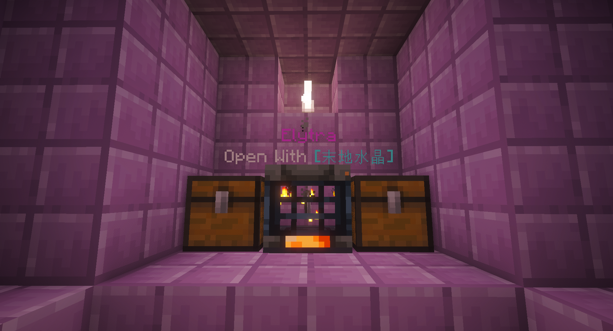

# 服务器插件指南

## 基础功能
- **传送/领地/经济**：按 `Shift+F` 打开菜单
- 
- **鞘翅刷新**：使用末地水晶激活末地船中的鞘翅宝库，让每位玩家都有公平获取机会

## 文字与装扮

### 多彩文字
- 使用 `&` 符号代替 `§` 输入彩色文字
- 支持 RGB 彩色文本，格式：`&#66ccff文字内容`
- 可在聊天、命名功能中使用
- 测试命令：`/echo [文本内容]`（仅自己可见）

### 物品展示
- **展示手中物品**：`/u show`（全服可见）
- **展示框保护**：
  1. 放置展示框并放入物品
  2. 执行 `/u lock setup`
  3. 右键查看物品信息，Shift+右键旋转
  4. 取消保护：`/u lock remove`

### 经验胶囊
- 存储经验：手持附魔之瓶，执行 `/u xp store [经验值]`
- 提取经验：
  - `/u xp take [经验值]`
  - 非潜行状态双击使用键（默认提取1%或10点）
  - `/u xp quicktake [经验值]` 自定义提取量
  - 潜行状态使用键释放全部经验

### 自动飞行
- 手持刷子进入鞘翅飞行状态
- 速度过低时自动燃放烟花维持飞行
- 按住潜行键停止自动燃放

## 其他实用功能

### 编辑告示牌
- 命令：`/u signedit [行数1-4] [内容]`
- 支持多彩文字和空格
- 不可编辑特殊功能牌子（如商店牌）

### 席地而坐
- 主手为空，右键方块顶部
- 命令 `/u sit` 开关此功能
- 支持毛毯、床（白天）、台阶、楼梯等
